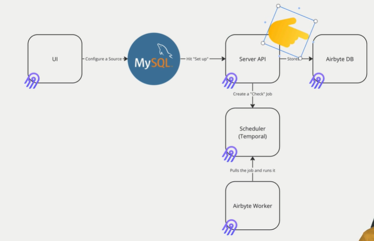

# Pourqoi airbyte

- Intégre facilement les nouvelles sources
- Plus besoin de faire faire des script personalisé
- Alerting et monitoring facilité
- Gére le changement de schema change
- Open-source
- UI
- Scalable
- Extensible : Création de son propre connecteur
- Extract, Load + Publish

# Core concept

- Source
- Destination
- Connector (Pull/Push)
- Stream (Ensemble de ligne)
- Field (colonne/clé)
- Connection (Automatique pipeline pour la réplication des données)

# Core compents
- Airbyte DB : toutes les meta-données
- Airbyte Webapp
- Airbyte server (API) : Création et gestion des ressource
- Temporal : scheduer
- Airbytes worker : pull jor from queue ande execute them

# Ne pas utiliser Airbyte
- Streaming
- Pas de connector (Attendre ou créer son connector)

# Airbyte colone

- _airbyte_raw_id : unique identifieur
- _airbyte_extracted_at : Date d'extraction
- _airbyte_loaded_at : Quand les données ont été extraite
- _airbyte_meta : les différente errors pour un enrigistrement spécifique + le sync qui à cette erreur
- _airbyte_data : les données sous forme de json

# Config

